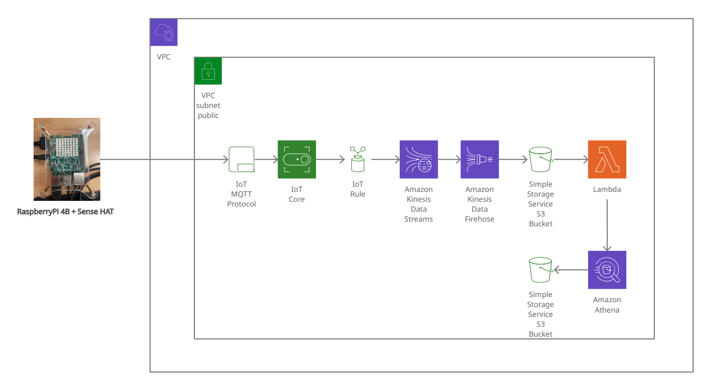

# **IoT 센서 로그 데이터 수집 및 적재 파이프라인 구축**

## Overview

이번 프로젝트에서는 RaspberryPi를 활용하여 실시간으로 센서(SenseHAT)에서 받은 데이터를 처리하도록 Kappa Architecture로 데이터 파이프라인을 구성하였습니다. 
받아온 데이터는 Kinesis data stream과 Kinesis data firehose를 통해 S3에 최종적으로 적재가 되고, 매번 센서 로그 파일이 쌓일때마다 Lambda에서 코드를 통해 DynamoDB에 파일 갯수를 카운트하게 되고, 20개의 파일이 적재되었을때 Amazon Athena를 통해 적재된 20개의 파일이 압축되어 별도의 S3 폴더에 저장되도록 구성하였습니다. 

S3에 적재된 데이터는 AWS의 QuickSight(BI 툴)서비스를 통해 시각화하여 처리할 수 있도록 구성하였고, 시간 단위로 Source 데이터를 업데이트가 되도록 구성하였습니다.

### Data Architecture



데이터 파이프라인에서 RaspberryPi의 센서 모듈(SenseHAT)로부터 생성된 데이터를 MQTT 메시지 프로토콜을 지원하는 mosquitto broker를 통해서 받아오고, Broker를 관리해주는 AWS 관리형 서비스인 IoT Core를 붙여서 구성하였습니다.
 
IoT Core를 별도로 붙여서 처리해준 이유는 

AWS의 서비스간에는 서로 통신을 하기 위해서 IoT rule을 연결해주는 작업을 할때 Kinesis data stream과 통신하기 위한 IAM Role을 적용시켰습니다. (`적용시에 직면했던 Issue에 대해서 아래에 별도로 작성을 하였습니다`)

If you decide to include this, you should also talk a bit about why you chose the architecture and tools you did for this project.

### Data Visualization


## Prerequisites

Directions or anything needed before running the project.

- Prerequisite 1
- Prerequisite 2
- Prerequisite 3

## How to Run This Project

Replace the example step-by-step instructions with your own.

1. Install x packages
2. Run command: `python x`
3. Make sure it's running properly by checking z
4. To clean up at the end, run script: `python cleanup.py`

## Lessons Learned

It's good to reflect on what you learned throughout the process of building this project. Here you might discuss what you would have done differently if you had more time/money/data. Did you end up choosing the right tools or would you try something else next time?

## Issues

데이터 파이프라인을 구축할때 직면했던 문제에 대해서 정리를 하려고 합니다. 

### **Issue1) <ins>IoT Rule 생성에서 IAM Role 설정</ins>**

mosquitto broker에서 RaspberryPi sensor로부터 받은 실시간 데이터를 Kinesis data stream으로 넘겨주기 위해서 IoT Rule에서 별도의 IAM Role을 설정해주는 부분이 있었는데, IAM Role 적용후에 아래의 에러 메시지가 출력되었다.
아래 에러 메시지에 따르면, 적용한 IAM Role이 막 생성되었거나 업데이트 되었다면 잠시후에 다시 시도해보라는데, 생성된지 꽤 되었음에도 같은 에러가 계속 발생하여 아래의 시도들을 통해 해결할 수 있었다. 

```
[Error message attachment]

An error occurred (InvalidRequestException) when calling the CreateTopicRule operation: AWS IoT (iot.amazonaws.com) is unable to assume role (sts:AssumeRole) on resource: arn:aws:iam::833496479373:role/my-iot-role.  If the role was just created or updated, please try again in a few seconds
```
**<ins>(Try 1)</ins>** IAM Role 메뉴에서 직접 역할을 생성하고, 정책으로는 `AmazonKinesisFullAccess`을 적용해주었다. 이렇게 생성한 role을 AWS의 IoT의 규칙을 생성할때 해당 IAM Role을 적용시켰는데, `같은 에러가 발생`하였다.

**<ins>(Try 2)</ins>** IoT 규칙을 생성할때 새로 Role을 생성하고, 내부 정책은 자동으로 생성되도록 하였다. (`정상처리`) 

-> IoT Rule 생성시에 자동 생성하였던 Role을 IAM Role의 리스트에서 확인해보았는데, 출력되지 않은 것으로 보아, IoT Rule에 적용되는 Role의 경우에는 별도로 관리가 되는 것 같다.
 

## Contact

Please feel free to contact me if you have any questions at: LinkedIn, Twitter
