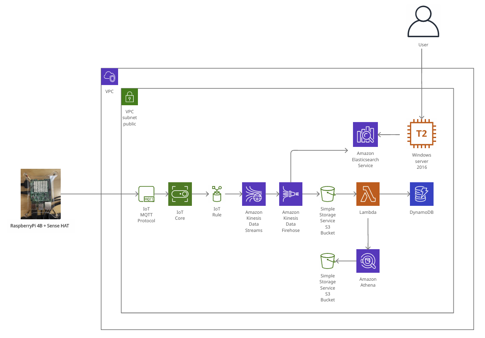

# **IoT 센서 로그 데이터 수집 및 적재 파이프라인 구축**

## **Overview**

이번 프로젝트에서는 RaspberryPi를 활용하여 실시간으로 센서(SenseHAT)에서 받은 데이터를 처리하도록 Kappa Architecture로 데이터 파이프라인을 구성하였습니다. 
받아온 데이터는 Kinesis data stream과 Kinesis data firehose를 통해 S3에 최종적으로 적재가 됩니다. 

센서 로그 파일의 경우, 파일이 쌓일때마다 Lambda에서 코드를 통해 DynamoDB에 파일 갯수를 카운트하게 되고, 20개의 파일이 적재되었을때 Amazon Athena를 통해 적재된 20개의 파일이 압축되어 별도의 S3 폴더에 저장되도록 구성하였습니다.

이렇게 S3에 적재된 데이터는 AWS의 QuickSight(BI툴)서비스를 통해 시각화하여 처리할 수 있도록 구성하였고, 시간 단위로 Source 데이터를 업데이트가 되도록 구성하였습니다.

<br/>

## **Dataset**

프로젝트에서 사용할 데이터는 라즈베리 파이(+SenseHAT)로부터 측정된 온/습도 센서 데이터를 활용했습니다. 실시간으로 생성되는 데이터를 S3와 Opensearch에 각 각 흘려서 처리하는 데이터 파이프라인을 구성해보기 위해 해당 데이터셋을 선정하였습니다.

<br/>

## **Objective**

이번 프로젝트를 통해 주어진 데이터셋을 분석하여 아래의 내용들과의 상관관계에 대해서 알아볼 것입니다.

- 시간대별 평균 온도/습도
- 시간 변화에 따른 온도/습도의 변화 

<br/>

## **Data Architecture**



### **(1) RaspberryPi(+SenseHAT) → AWS IoT Core**
데이터 파이프라인에서 RaspberryPi의 센서 모듈(SenseHAT)로부터 생성된 데이터를 MQTT 메시지 프로토콜을 구현한 mosquitto broker를 통해서 받아오고, Broker를 관리해주는 AWS 관리형 서비스인 IoT Core를 붙여서 구성하였습니다.

IoT Core를 별도로 붙여서 처리해준 이유는 IoT Core를 사용하면, 대용량 데이터를 전송하기 적합한 MQTT 프로토콜을 사용하여 통신을 할 수 있으며, broker를 관리하기 용이하기 때문입니다. 

HTTP로도 `동기식 통신`을 통하여 데이터를 받아서 처리할 수 있지만, client의 요청을 server에서 응답할 때 까지 기다리기 때문에 효율적이지 않은 방식이며, 그외에도 클라이언트에서 한 번 요청한 내용에 대해서 기억하지 않는 특징(stateless)을 가지고 있습니다.

따라서 `비동기식 통신`으로 MQTT 프로토콜을 구현한 메시지 브로커(mosquitto)를 통하여 라즈베리파이의 센서로부터 전송된 데이터를 전송하였고, 비동기 통신이기 때문에 브로커에 메시지를 전달하기만 하고, 별도의 응답을 위한 대기 시간이 필요하지 않습니다. (`pub/sub 구조`)

(MQTT는 경량이며, 저전력 단일 보드 컴퓨터에서 서버에 이르기까지 모든 장치에 사용하기 적합하며, pub/sub구조의 모델을 사용하여 가볍게 메시지를 전달하기 때문에 저전력 센서나 모바일 기기(폰, 임베디드 컴퓨터나 마이크로 컨트롤러)와 같은 IoT기기로부터 메시지를 전달하기 적합합니다)

<br/>

### **(2) AWS IoT Core → AWS IoT Rule → Amazon Kinesis Data Streams**

라즈베리파이의 SenseHAT 모듈로부터 생성된 센서 데이터는 지정 Topic으로 전송을 하도록 코드를 작성하였습니다.
AWS의 서비스간에는 서로 통신을 하기 위해서 IoT rule을 연결해주는 작업을 할때 Kinesis data stream과 통신하기 위한 IAM Role을 적용시켰습니다. (`적용시에 직면했던 Issue에 대해서 아래에 별도로 작성을 하였습니다`)

IoT Rule에서는 어떠한 데이터를 가져올지에 대한 SQL 쿼리문을 정의할 수 있으며, 수신된 메시지를 받아온 후의 다음 규칙 작업에 대해서 정의를 합니다. 

#### **Kinesis data stream을 선택한 이유**
우선 Kinesis data stream을 사용하게 되면, 다중 클라이언트(Consumer)가 같은 데이터 스트림으로부터 동시에 메시지를 읽도록 할 수 있고, pub/sub 구조로 메시지를 생산하고 소비하는 양 끝단을 서로 분리시킴으로써 데이터 파이프라인에서 각 구성 요소가 독립적으로 실행되고, 장애 발생으로 인한 시스템 전체의 내결함성이 향상됩니다. 

현재는 단일 IoT 기기로부터 데이터를 받아서 처리하기 때문에 Bottleneck과 같은 부분의 문제는 고려하지 않아도 되지만, 만약 데이터의 양과 데이터 파이프라인이 복잡해질수록 아래의 문제가 발생할 소지가 있습니다.

<table>
    <tr>
        <th style="text-align:center">ISSUE</th>
        <th style="text-align:center">RESULT</th>
    </tr>
    <tr>
        <td>
        ① Producer로부터 전송되는 데이터가 증가 <br/>
        (기존에 설정한 Shard 수가 감당이 안되는 경우)
        </td>
        <td>Kinesis data stream에서 shard의 수 및 초당 처리되는 데이터의 용량을 증가시켜준다.</td>
    </tr>
    <tr>
        <td>
        ② Data stream으로부터 데이터를 받는 Consumer의 증가<br/>
        (데이터 파이프라인의 복잡도 증가)
        </td>
        <td>Kinesis data stream 서비스 사용에 대한 비용이 증가</td>
    </tr>
</table>

위의 문제에 대해 각 각의 대처나 예상되는 결과에 대해서 생각을 작성을 해보았습니다. ISSUE ①에 대한 대처는 클라우드 플랫폼의 사용에 대한 비용적 부담을 가중시키기 때문에 본질적인 해결책이 될 수 없습니다. 또한 ISSUE ②에 대해서도 결국에 ISSUE ①과 같이 서비스 사용에 대한 비용적 부담을 가중시키기 때문에 기존에 사용되었던 Kinesis data stream을 다른 서비스로 대체할 수 있는지 고려해야 된다고 생각했습니다.

<table>
    <tr>
        <th style="text-align:center">SOLUTION</th>
    </tr>
    <tr>
        <td>① 기존 Kinesis data stream을 대체하여 직접 AWS EC2 인스턴스에 Kafka를 직접 설치/운영하여 관리합니다.</td>
    </tr>
    <tr>
        <td>② 기존 Kinesis data stream을 대체하여 AWS의 KMS 완전 관리형 서비스를 사용하여 관리합니다.</td>
    </tr>
</table>

해결책으로 위의 두 가지를 제시할 수 있습니다. 만약 해당 데이터 파이프라인을 유지/관리할 수 있는 인적 자원이 충분하다면, 직접 EC2 인스턴스에 Kafka를 구축하여 직접 운영 및 관리를 할 수도 있지만, 그렇지 않은 경우에는 AWS의 KMS 서비스를 사용하여 관리 및 운영 비용을 최소화하며 관리할 수 있습니다. 

AWS와 같은 클라우드 서비스를 사용하는 이유는 관리적 요소가 적은 서비스로 구성을 하여, 관리의 대상을 최소화하고, 서비스에 온전히 집중할 수 있도록 하는 것이 좋다고 판단되기 때문에 위의 문제점들에 대해서는 AWS의 KMS 서비스를 이용해서 관리하는 것이 더 효율적이라고 판단했습니다. 

현재 구성한 데이터 파이프라인에서는 위와같은 한계점에 대해서 고려하지 않아도 문제가 되지 않지만, 향후 직접 대용량의 데이터를 넘겨서 처리해야되는 경우에는 위와같은 요소들을 고려해야 합니다.

<br/>

### **(3) Amazon Kinesis Data Streams → Amazon Kinesis Data Firehose → S3 → Lambda → DynamoDB → Amazon Athena → S3**

Amazon Kinesis Data Streams으로 들어온 데이터가 Firehose를 통해서 S3의 지정 bucket에 적재가 되면 Amazon Lambda가 트리거 되어, 작성된 파이썬 스크립트를 통해 아래의 로직이 실행이 됩니다.


<br/>

### **(4) Amazon Kinesis Data Streams → Amazon Kinesis Data Firehose → Opensearch(Elasticsearch) service → Kibana → EC2**

Amazon Kinesis Data Streams으로부터 들어온 데이터가 Firehose를 통해서 Opensearch(Elasticsearch)서비스로 데이터를 인덱싱합니다. Firehose에서 Destination으로 Opensearch를 지정할때, Index와 Index rotation을 지정하게 되는데, Index는 sensor-log, Index rotation은 Every hour로 설정하여, 시간대별로 인덱스를 나눠서 데이터를 인덱싱할 수 있도록 하였습니다.

그리고 Opensearch service를 생성할때 별도의 VPC와 Subnet을 지정하여 생성하였기 때문에 Firehose destination의 VPC connection에 대한 설정도 별도로 Subnet과 AZ를 지정(`172.31.0.0/20, ap-northeast-2a`)하였습니다.
단, 별도의 Subnet과 AZ(가용영역)에 대해 설정을 하여 Opensearch service를 생성하였기 때문에 로컬 환경의 브라우저 상에서 Kibana Endpoint URL을 통해 접근을 할 수 없습니다.(`다른 도메인`) 따라서 같은 도메인을 갖는 EC2 인스턴스(Windows server 2016)를 생성하여 Opensearch service와 연동된 Kibana에 접근하고, Opensearch service에 적재된 데이터를 활용하여 시각화를 해보았습니다.   

<br/>

## **Data Transformation & Visualization**

온/습도 측정은 2022년 07월 14일 00시부터 14시까지 측정하였습니다. 온도의 경우에는 측정하는데 사용된 라즈베리 파이 기판의 표면 온도에 따라 다소 높게 측정될 수도 있다는 점을 고려하여 해석하였으며, 00시(`UTC+0 기준 15시`)에는 실내에 잠시 라즈베리파이를 비치하였기 때문에 실제 온도 변화추이는 01시(`UTC+0 기준 16시`)를 시작으로 해석하였습니다. 

아래에 자세하게 온/습도 변화의 추이에 대해서 분석한 내용을 작성하였지만, 온/습도가 모두 00~02시(`증감`), 02~06시(`유지`), 06~10시(`증감`), 10~14시(`유지`)의 패턴으로 같은 변화추이를 보이고 있습니다. 
또한 온도가 증가하면, 습도는 상대적으로 낮아지고, 온도가 감소하면, 습도가 상대적으로 높아지는 것을 확인할 수 있었습니다. 

<table>
    <tr>
        <th style="text-align:center">NO</th>
        <th style="text-align:center">Image</th>
        <th style="text-align:center">Description</th>
    </tr>
    <tr>
        <td>1</td>
        <td>
            
        </td>
        <td>
            <b>[시간대별 평균 온도]</b><br/>
            <small>시간대별 평균 온도의 변화추이는 00시부터 02시 사이에 온도가 점차 줄어들다가 02시부터 06시까지 28~29도를 유지하고 있습니다. 이후에 06시부터 10시까지 온도가 다시 증가하는 것을 확인할 수 있으며, 10시부터 14시까지는 35~36도 사이로 온도가 유지되는 것을 확인할 수 있었습니다.</small>     
        </td>
    </tr>
    <tr>
        <td>2</td>
        <td>
            
        </td>
        <td>
        <b>[시간대별 평균 습도]</b>
        <br/>
        <small>시간대별 평균 습도는 00시부터 02시 사이에 습도가 점차 증가를 하다가 02시부터 06시까지 69~73 수치를 유지하고 있습니다. 이후에 06시부터 10시까지 습도가 점차 감소하다가 10~14시에는 49~53도 사이로 습도가 유지되는 것을 확인할 수 있었습니다.</small>
        </td>
    </tr>
    <tr>
        <td>3</td>
        <td>
            
        </td>
        <td>
            <b>[시간 변화에 따른 온도의 변화]</b>
            <br/>
            <small>앞서 시간대별 온도의 변화추이를 살펴보았듯이 온도가 새벽시간대에 낮아지다가 유지가 되고, 아침이 되면 다시 올라가다가 오후시간대에 다시 유지가 되는 변화추이를 관찰할 수 있습니다.</small>
        </td>
    </tr>
    <tr>
        <td>4</td>
        <td>
            
        </td>
        <td>
        <b>[시간 변화에 따른 습도의 변화]</b>
            <br/>
            <small>앞서 시간대별 습도의 변화추이를 살펴보았듯이 습도가 새벽시간대에 높아지다가 유지가되고, 아침에 온도가 올라감과 동시에 습도가 내려가다가 오후시간대에 습도가 유지되는 변화추이를 관찰할 수 있었습니다.</small>
        </td>
    </tr>
</table>

<br/>

<br/>

## Prerequisites

Directions or anything needed before running the project.

- AWS 계정을 준비
- 코드를 실행할 IDE (VSCODE, Sublime Text 등) 준비
- 라즈베리파이에 운영체제를 설치하기 위해 micro SD 카드 준비 및 운영체제 설치

<br/>

## How to Run This Project

- 라즈베리파이와 AWS IoT Core를 연동 
    - 디바이스 SDK 설치
        - cmake, libssl-dev, git, python3(over v3.6), pip3 설치
            ```zsh
            $ sudo apt install cmake libssl-dev git python3-pip
            ```
        - Python 전용 AWS IoT Device SDK 설치
            - 참고 : https://github.com/aws/aws-iot-device-sdk-python-v2

            ```zsh
            <!-- Install from PyPI -->
            $ python3 -m pip install awsiotsdk

            <!-- Install from source -->
            <!-- Create a workspace directory to hold all the SDK files -->
            mkdir sdk-workspace
            cd sdk-workspace
            
            <!-- Clone the repository -->
            git clone https://github.com/aws/aws-iot-device-sdk-python-v2.git
            
            <!-- Install using Pip -->
            python3 -m pip install ./aws-iot-device-sdk-python-v2
            ```
    
    <br/>

    - 인증서 설치 

        AWS IoT Core에서 디바이스를 등록하면, 인증서(`*.pem, *.pem.crt, *.pen.key`) 파일이 생성된다. 해당 파일을 라즈베리파이에 디렉토리를 만들어서 위치시킨다.
            
            - Root CA 인증서 : raspberrypi-sensor-device.cert.pem
            - Device 인증서 : root-CA.crt
            - Private 키 : raspberrypi-sensor-device.private.key
    
    <br/>

    - Publish 파이썬 코드 작성

        (프로젝트 내의 `data-publish` 디렉토리 내의 sensor_publish.py 코드 참고) 
        AWS IoT Core에서 관리>사물을 확인해보면, `END POINT URL`, `디바이스 이름`을 확인할 수 있는데, 해당 정보를 publish 파이썬 코드에 업데이트를 해주고, 앞서 생성한 인증서의 위치 정보도 코드에 업데이트를 시켜준다.

    <br/>

    - Publish 파이썬 코드 실행 및 전송 데이터 

        라즈베리파이에서 작성한 Publish 파이썬 코드를 실행해서 data를 publish하면, AWS IoT Core 서비스에서 `테스트 - MQTT 테스트 클라이언트`를 통해 흘러가는 데이터를 확인할 수 있다.

    <br/>

- IoT Core에서 브로커로부터 받은 데이터를 Kinesis data streams로 넘기기 
    - Broker로부터 취득한 데이터를 Kinesis data stream으로 흘려보내주기 위해서 IoT Core에서 IoT Rule을 생성해준다. Rule 생성시에 흘려보낼 target component와 통신을 위한 역할을 설정해준다.

<br/>

- Kinesis data firehose 생성
    
    이번 프로젝트에서는 데이터를 Opensearch service와 S3 Bucket에 로그 데이터를 압축해서 저장할 것이기 때문에 2개의 firehose를 생성해준다.
    <br/>

    - OpenSearch service 
        - 두 개의 Firehose 중에 하나의 destination을 Opensearch로 해주게 되면, 연결해줄 VPC, Subnet 등을 설정을 해줘야 된다. <br/> Opensearch 서비스를 생성할때에도 Opensearch 서비스 도메인을 VPC 내에 배치를 해줌으로써 인터넷 게이트웨이와 같은 별도의 연결없이도 OpenSearch 서비스와 VPC 내의 다른 서비스 간의 보안 통신이 가능하기 때문에 VPC를 설정하여 서비스를 생성해준다. 

        <br/>

        - OpenSearch 서비스에 적재된 데이터로 대시보드를 생성해서 시각화하기 위해서는 같은 도메인 상에 있는 EC2 인스턴스를 생성해준다. 프로젝트에서는 Windows server 2016을 생성해서 OpenSearch 대시보드 URL을 통해 접근한다.

    <br/>

    - S3 bucket
        -  남은 하나의 Firehose의 Destination으로는 S3 bucket으로 설정을 해주는데, 설정한 target directory는 Lambda와 트리거 되어있기 때문에 데이터가 쌓이게 되면, DynamoDB의 테이블에서 쌓인 파일의 갯수를 카운트해주게 된다.<br/>쌓인 데이터 파일이 100개(설정값)이 되면, Athena를 통해 CTAS 쿼리를 실행해서 별도의 압축된 형태로 데이터를 S3 bucket에 저장을 하게 된다. 
        
        <br/>

        - 우선 target으로 지정할 bucket을 생성을 해주고, target S3 bucket과 트리거 되어있는 Lambda함수를 생성해준다. 그리고 프로젝트의 `data-compactor/sensor-log-compactor.py`의 코드를 코드 탭의 editor에 넣어주고, `구성-환경 변수`에서 코드실행에서 필요한 환경 변수를 입력해준다. 

        <br/>

        - Athena에서 CTAS 쿼리를 실행해서 쌓인 데이터 파일들을 100개 단위로 압축해줄 것이기 때문에 Athena에서 데이터의 schema에 맞춰 테이블을 새로 생성해준다.

## Lessons Learned

### Mosquitto와 RabbitMQ

이번 프로젝트에서는 mosquitto 메시지 브로커를 사용하여 IoT 기기로부터의 센서 데이터를 Kinesis data stream으로 전달하도록 구성하였습니다.

It's good to reflect on what you learned throughout the process of building this project. Here you might discuss what you would have done differently if you had more time/money/data. Did you end up choosing the right tools or would you try something else next time?

## **Issues**

데이터 파이프라인을 구축할때 직면했던 문제에 대해서 정리를 하려고 합니다. 

### **Issue1) <ins>IoT Rule 생성에서 IAM Role 설정</ins>**

mosquitto broker에서 RaspberryPi sensor로부터 받은 실시간 데이터를 Kinesis data stream으로 넘겨주기 위해서 IoT Rule에서 별도의 IAM Role을 설정해주는 부분이 있었는데, IAM Role 적용후에 아래의 에러 메시지가 출력되었다.
아래 에러 메시지에 따르면, 적용한 IAM Role이 막 생성되었거나 업데이트 되었다면 잠시후에 다시 시도해보라는데, 생성된지 꽤 되었음에도 같은 에러가 계속 발생하여 아래의 시도들을 통해 해결할 수 있었다. 

```
[Error message attachment]

An error occurred (InvalidRequestException) when calling the CreateTopicRule operation: AWS IoT (iot.amazonaws.com) is unable to assume role (sts:AssumeRole) on resource: arn:aws:iam::833496479373:role/my-iot-role.  If the role was just created or updated, please try again in a few seconds
```
**<ins>(Try 1)</ins>** IAM Role 메뉴에서 직접 역할을 생성하고, 정책으로는 `AmazonKinesisFullAccess`을 적용해주었다. 이렇게 생성한 role을 AWS의 IoT의 규칙을 생성할때 해당 IAM Role을 적용시켰는데, `같은 에러가 발생`하였다.

**<ins>(Try 2)</ins>** IoT 규칙을 생성할때 새로 Role을 생성하고, 내부 정책은 자동으로 생성되도록 하였다. (`정상처리`) 

-> IoT Rule 생성시에 자동 생성하였던 Role을 IAM Role의 리스트에서 확인해보았는데, 출력되지 않은 것으로 보아, IoT Rule에 적용되는 Role의 경우에는 별도로 관리가 되는 것 같다.
 

## Contact

Please feel free to contact me if you have any questions at: LinkedIn, Twitter
